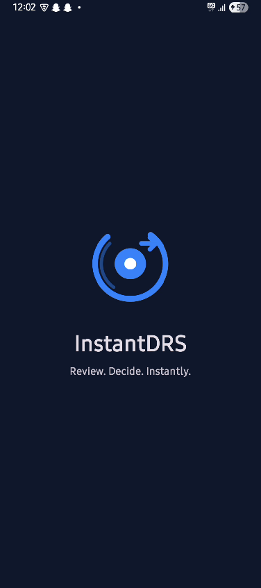
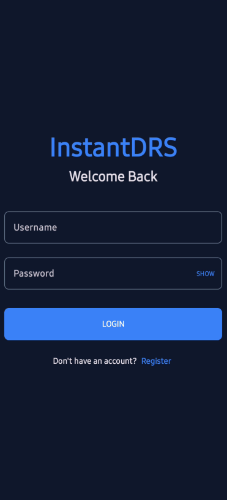
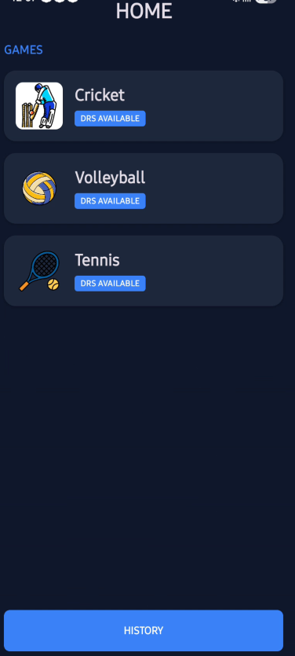
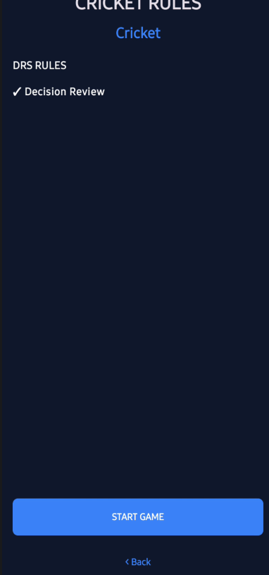
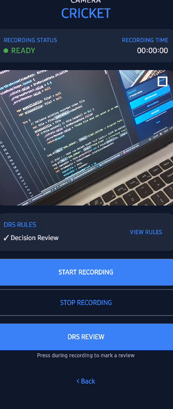
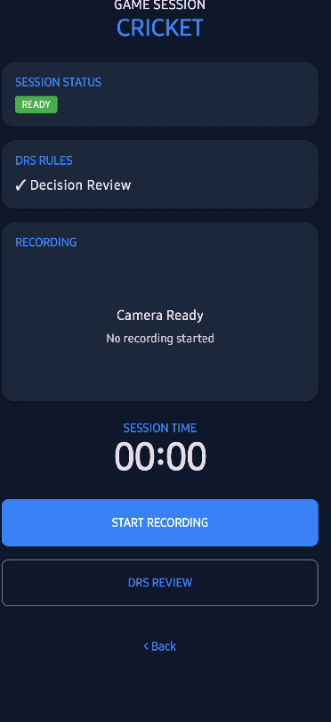
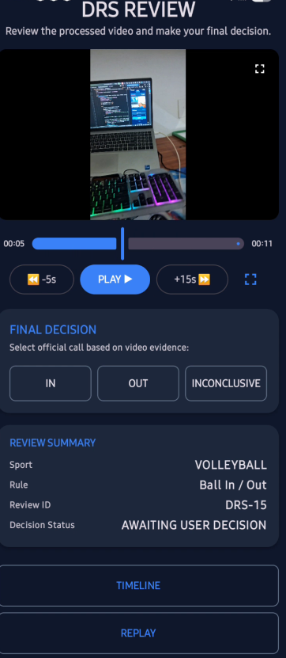
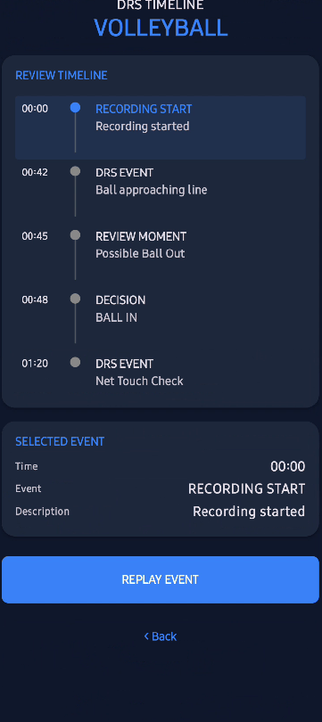
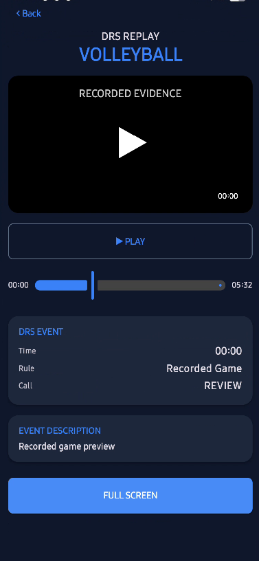

# InstantDRS

**InstantDRS** is a sports video-review system designed to help players and officials quickly review important game events.

> **Video Review & Decision by User**

InstantDRS processes a short event video using video processing and sports-ball tracking and provides a reviewable video. The system does **not** automatically make the final sports decision. The final decision is made by the user or official after reviewing the video.

---

# 📱 App Screenshots

## 🚀 Application Start

### Splash Screen



---

## 🔐 Authentication

### Login



---

## 🏠 Main Application

### Home



### Game Rules



---

## 🎥 Recording & DRS

### Camera



### Recording Preview



---

## 🔍 Video Review

### DRS Review



### Timeline



### Replay



---

## 📂 History

### DRS History


---

# 🚀 DRS Workflow

```text
Record Event
      ↓
User Presses DRS
      ↓
Capture Event Clip
      ↓
Upload to Backend
      ↓
Create DRS Session
      ↓
Video Processing
      ↓
Sports Ball Tracking
      ↓
0.5× Slow Motion
      ↓
Audio Mux
      ↓
Final Review Video
      ↓
Android Video Review
      ↓
Final Decision by User / Official
```

---

# ✨ Features

- Android-based DRS review workflow
- User authentication
- DRS session management
- Event video recording
- Event video upload
- Sports-ball detection and tracking
- Slow-motion video review
- Audio preservation
- Timeline-based review
- Replay functionality
- DRS session history
- Full-screen video review
- Manual final decision by the user

---

# 🏏 Supported Sports

InstantDRS is designed to support multiple sports:

- Cricket
- Volleyball
- Tennis
- Basketball
- Football

The final decision remains with the user or official.

---

# 🛠️ Technology Stack

## Android Frontend

- Kotlin
- Jetpack Compose
- CameraX
- Retrofit
- Gson
- Media3 / ExoPlayer
- ViewModel
- Coroutines

## Backend

- Java 21
- Spring Boot
- Spring Data JPA
- MySQL
- BCrypt
- REST APIs
- Maven

## Video Engine

- Python
- OpenCV
- OpenVINO
- YOLO-based sports-ball detection
- FFmpeg
- RIFE

---

# 📁 Project Structure

```text
InstantDRS/
│
├── README.md
│
├── screenshots/
│   ├── camera.png
│   ├── drs-review.png
│   ├── game-rules.png
│   ├── history.png
│   ├── home.png
│   ├── login.png
│   ├── recording_preview.png
│   ├── replay.png
│   ├── splash.png
│   └── timeline.png
│
├── InstantDRS-fronten/
│   └── Android application
│
├── instantDRS-backend2.0/
│   └── Spring Boot backend
│
└── video-engine/
    ├── tool1-slow-motion/
    ├── tool2-120fps/
    ├── tool3-sports-ball-tracking/
    ├── pipeline/
    └── rife/
```

---

# 🎥 Backend API

## Authentication

```http
POST /api/auth/register
POST /api/auth/login
```

## DRS Sessions

```http
POST /api/drs/sessions
GET  /api/drs/sessions
GET  /api/drs/sessions/{id}
```

## Video

```http
POST /api/drs/sessions/{id}/video
POST /api/drs/sessions/{id}/process
GET  /api/drs/sessions/{id}/video
```

---

# 💻 Local Backend Setup

## Requirements

- Java 21
- MySQL 8
- Python
- FFmpeg
- Git
- Android Studio

Create the database:

```sql
CREATE DATABASE instant_drs;
```

Set the required environment variables:

```powershell
$env:DB_URL="jdbc:mysql://localhost:3306/instant_drs?useSSL=false&serverTimezone=Asia/Kolkata&allowPublicKeyRetrieval=true"
$env:DB_USERNAME="root"
$env:DB_PASSWORD="YOUR_PASSWORD"

$env:VIDEO_ENGINE_PYTHON="PATH_TO_PYTHON"
$env:VIDEO_ENGINE_PIPELINE="PATH_TO_RUN_PIPELINE"
$env:VIDEO_ENGINE_FAST_PIPELINE="PATH_TO_FAST_PIPELINE"
$env:VIDEO_ENGINE_USE_FAST="true"

$env:SPRING_PROFILES_ACTIVE="prod"
```

Start the backend:

```powershell
.\mvnw.cmd spring-boot:run
```

Local backend:

```text
http://localhost:8080
```

---

# 📱 Android Setup

Open the Android project:

```text
InstantDRS-fronten
```

in Android Studio.

For a physical Android device:

```powershell
$env:LOCALAPPDATA\Android\Sdk\platform-tools\adb.exe reverse tcp:8080 tcp:8080
```

Build the application:

```powershell
.\gradlew.bat assembleDebug
```

---

# 🎬 Video Processing

The current fast processing pipeline is:

```text
Input Event Clip
      ↓
OpenCV Frame Processing
      ↓
OpenVINO Sports-Ball Tracking
      ↓
0.5× Slow Motion
      ↓
Audio Mux
      ↓
Final MP4
```

Fast pipeline:

```text
video-engine/pipeline/fast_drs_pipeline.py
```

Sports-ball tracking:

```text
video-engine/tool3-sports-ball-tracking/
```

---

# 🧪 Testing

The project is tested across:

- User registration
- User login
- DRS session creation
- Video upload
- Video processing
- Processed video playback
- Sports-ball tracking
- Android recording
- DRS trigger
- Timeline
- Replay
- History
- Full-screen video review
- End-to-end workflow

---

# 🚀 Deployment Roadmap

```text
1. Make Spring Boot production-ready       ✓
2. Deploy Spring Boot backend              → Current
3. Deploy/connect cloud MySQL
4. Test every API using Postman
5. Connect Android app to online API
6. Deploy/test video engine
7. Test on another phone/network
8. Generate signed release APK
9. Distribute APK for testing
10. Publish on Google Play
```

---

# 🔒 Security

Never commit:

- Database passwords
- API keys
- Cloud credentials
- SSH private keys
- Authentication tokens
- Production secrets

Use environment variables for sensitive configuration.

---

# 📌 Product Principle

InstantDRS is a **video review assistance system**, not an automated decision-making system.

```text
Video Processing
      ↓
Video Review
      ↓
User / Official
      ↓
FINAL DECISION
```

The computer-vision system assists with video review. It does not make the final sports decision.

---

# 👨‍💻 Author

**Shivansh Tiwari**

B.Tech CSE

---

## 📄 License

This project is currently a personal/academic project.